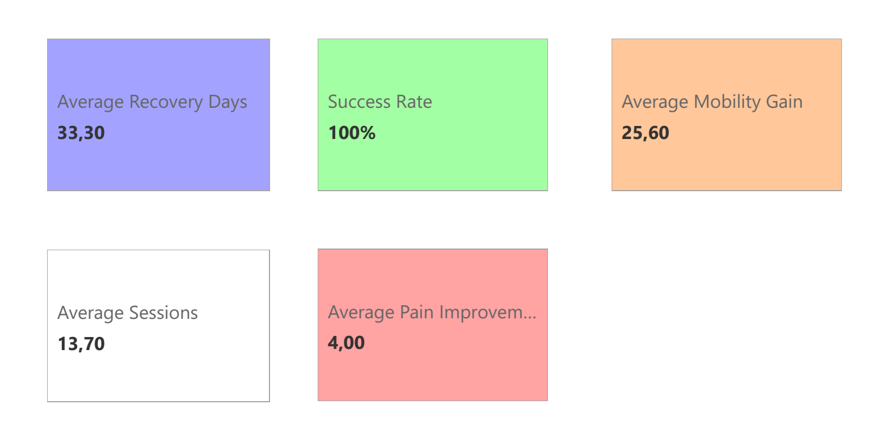
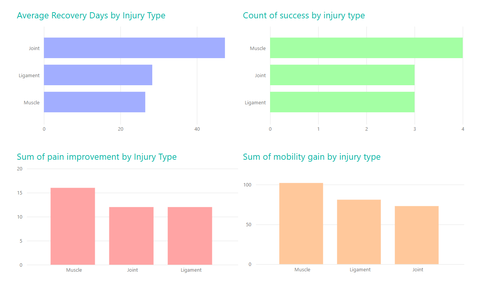
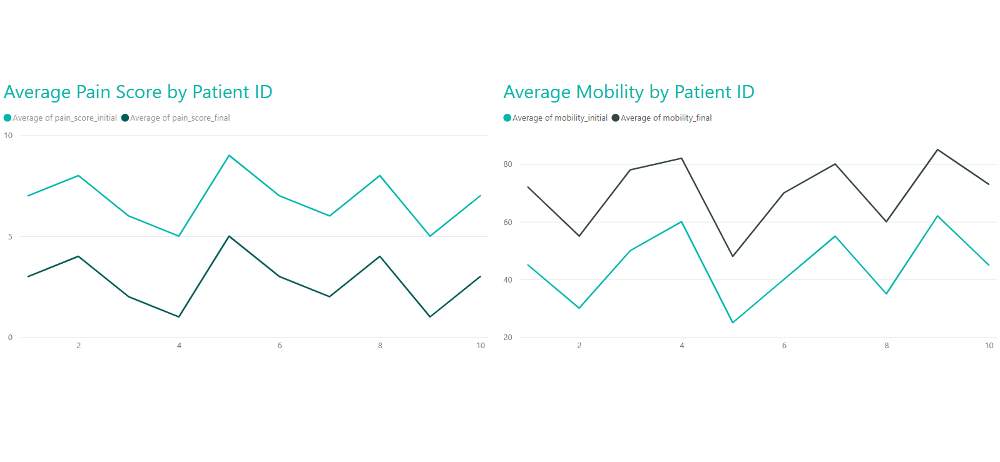
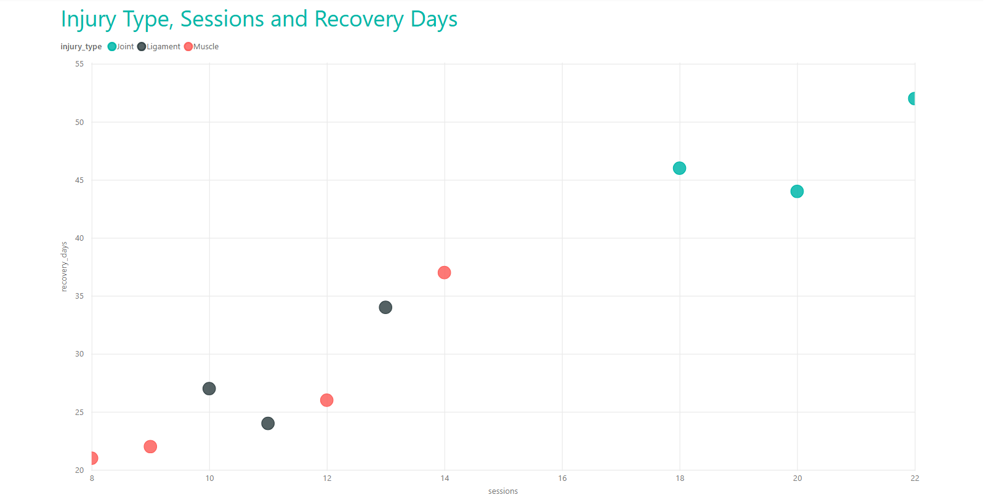

# 🏥 Clinical KPI Dashboard  
A complete end‑to‑end healthcare analytics project using Python, Power BI and ETL pipelines.

This project simulates a real clinical rehabilitation workflow, transforming raw patient data into actionable insights through data cleaning, exploratory analysis, KPI generation and interactive dashboards.  
It was designed to demonstrate professional skills in Healthcare Data Analysis, ETL, Python, DAX, and Power BI dashboard design.

---

## 📊 Project Overview

This project analyzes synthetic clinical rehabilitation data, focusing on patient recovery, pain reduction, mobility improvement and treatment efficiency.  
The goal is to build a full analytical pipeline that mirrors real-world healthcare analytics tasks:

- Data ingestion  
- Data cleaning and validation  
- KPI creation  
- Exploratory Data Analysis (EDA)  
- Clinical visualizations  
- Power BI dashboard  
- ETL automation  

---

## 🧱 Project Structure
```
Clinical-KPI-Dashboard/
│
├── docs/
│   └── README_technical.md   # Technical Documentation
├── data/                     # Raw and cleaned datasets
│   ├── clinical_data.csv
│   └── README.md
│
├── notebooks/                # Jupyter notebooks for analysis
│   ├── data_cleaning.ipynb
│   ├── analysis.ipynb
│   └── visualizations.ipynb
│
├── src/                      # ETL pipeline
│   └── etl_pipeline.py
│
├── powerbi/                  # Power BI dashboard
│   └── dashboard.pbix
│
└── README.md                 # Main project documentation
```
---

## 📄 Technical Documentation

For a deeper explanation of the ETL pipeline, data cleaning logic, KPI calculations, and project architecture, see the full technical documentation:

👉 **[Technical README (docs/README_technical.md)](docs/README_technical.md)**

This document includes:
- Detailed ETL workflow  
- Data dictionary  
- KPI mathematical definitions  
- Python processing steps  
- Power BI data model explanation  
- Design decisions and limitations  

---

## 🏥 Clinical KPIs Included

### Recovery Metrics
- Average Recovery Days  
- Recovery Time Distribution  
- Recovery by Injury Type

### Pain & Mobility Metrics
- Pain Improvement  
- Mobility Gain  
- Patient Evolution Over Time

### Treatment Efficiency
- Sessions vs Recovery Days  
- Success Rate (clinical outcome)  
- Efficiency by Injury Type

---

## 🧪 Technologies Used

| Area | Tools |
|------|-------|
| Data Cleaning | Python, Pandas |
| Analysis | Python, Seaborn, Matplotlib |
| ETL | Python, Custom Pipeline |
| Dashboard | Power BI, DAX |
| Documentation | Markdown, GitHub |

---

## ⚙️ ETL Pipeline

The ETL pipeline (`etl_pipeline.py`) performs:

- Loading raw clinical data  
- Removing duplicates  
- Converting date formats  
- Creating KPIs (recovery days, pain improvement, mobility gain, success flag)  
- Exporting cleaned dataset for analysis and dashboarding  

This ensures a reproducible and automated workflow.

---

## 📈 Power BI Dashboard

The dashboard includes:

### Page 1 — Overview
- Recovery KPIs  
- Pain & mobility KPIs  
- Success Rate  
- Sessions average  

### Page 2 — Injury Type Analysis
- Recovery by injury type  
- Success rate by injury type  
- Pain & mobility distribution  

### Page 3 — Patient Evolution
- Pain initial vs final  
- Mobility initial vs final  

### Page 4 — Treatment Efficiency
- Sessions vs recovery days  
- Efficiency insights  

The `.pbix` file is available in the `powerbi/` folder.

---

## 📸 Dashboard Screenshots

Below are key views of the Power BI dashboard included in this project.

### 🧭 Overview Page
The main KPI summary of the clinical dataset.



---

### 🩺 Injury Type Analysis
Average recovery days by injury type.



---

### 📈 Patient Evolution
Pain and mobility progression throughout treatment.



---

### ⚙️ Sessions Efficiency
Relationship between number of sessions and recovery performance.




---

## 🔬 Key Insights

- Muscle injuries recover faster and show higher mobility gains.  
- Joint injuries require more sessions and have lower success rates.  
- Pain improvement strongly correlates with mobility gain.  
- Most successful cases occur with fewer than 12 sessions.  
- Higher initial mobility predicts faster recovery.  

These insights mimic real rehabilitation analytics used in clinical decision-making.

---

## 🚀 How to Run the Project

### 1. Run the ETL Pipeline
```bash
python src/etl_pipeline.py
```

### 2. Open the Notebooks
Use Jupyter, VS Code or Google Colab.

### 3. Open the Power BI Dashboard
Load:
```
powerbi/dashboard.pbix
```

### 4. Explore the Data
Use the cleaned dataset:
```
data/clinical_data_cleaned.csv
```

---

📬 Author
Renato Maciel da Silva<br>
Healthcare Data Analyst | Biomedical Engineer<br>
Porto Metropolitan Area, Portugal<br>
LinkedIn: https://linkedin.com/in/renato-maciel-silva <br>
GitHub: https://github.com/Renato-M-Silva<br>

---

📄 License
This project uses synthetic data, safe for public use.
Feel free to fork, study, or adapt the project.
